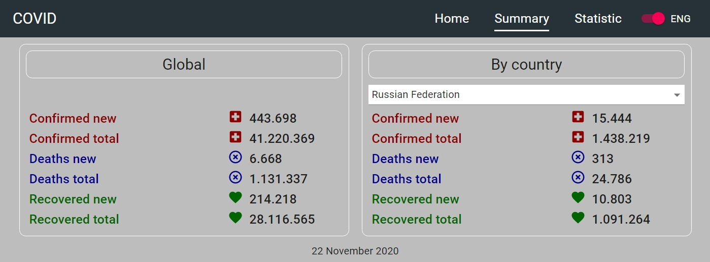

# Covid
Ссылка: https://alexaltrex.github.io/Covid

## Описание
Статистика по COVID-19

## Запуск проекта:
Для установки и запуска необходимы установленные программы: Node.js, npm, Git;
1. Клонирование и запуск: git clone https://github.com/Alexaltrex/Covid.git;
2. Переход в директорию с проектом: cd Covid;
3. Установка зависимостей: npm install;
4. Запуск проекта в режиме разработки: npm start;
5. Перейти в браузер и открыть страницу: http://localhost:3000.

## Цель проекта
* Изучение основ React и Redux;
* Изучение методов жизненного цикла классовых компонент;
* Переход с классовых компонент и оберток на функциональные компоненты и кастомные хуки
* Интеграция Canvas в React c поддержкой реакции на  события взаимодействия с элементами Canvas
* Изучение основных паттернов типизации React-приложения;
* Изучение библиотеки Material-UI.

## Разработка
* Приложение разработано на базе библиотеки React v.16.13.1 с использованием Create React App (https://github.com/facebook/create-react-app)
* Приложение разработано на базе API: 'https://api.covid19api.com'
* Глобальное состояние: управление - Redux v.4.0.5, доступ - react-redux v.7.2.0 (хуки useSelector и useDispatch)
* Все компонетны - "глупые", вместо оберток - кастомные хуки
* Работа с графикой: нативный Canvas, функциональные компоненты, отрисовка с помощью хуков "useRef" и "useEffect"
* Локальное состояние: хук "useState"
* Побочные эффекты: хук "useEffect"
* Роутинг: React-router-dom v.5.2.0
* Асинхронный код: Redux-thunk v.2.3.0
* Сетевые запросы: Axios v.0.19.2
* Сохранение и чтение локальных данных после перезагрузки страницы в url: "use-query-params" v.1.1.9
* Работа с формами: Redux-form v.8.3.6
* Дизайн: Material-UI v.4.11.0
* Типизация - Typescript v.3.7.2

## Структура приложения

### 1. Заголовок:
* Логотип;
* Меню с ссылками на страницы "Home", "Summary" и "Statistic";
* Переключатель языка (английский по определению или русский);

## 2. Страница "Summary"
Суммарная статистика по всему миру и для конкретной выбранной страны для случаев: заболевшие, умершие, вылечившиеся, за день или всего. Статистика приводится за последнюю актуальную дату. 

## 3. Страница "Statistic"
График с динамикой изменения данных. График строится для конкретных выбранных параметров: страна, период (1 неделя, 2 недели, месяц или с начала), за день или всего, тип (заболевшие, умершие или вылечившиеся).
При наведении указателем отображается всплывающее окно с данными и датой в конкретной точке графика.

